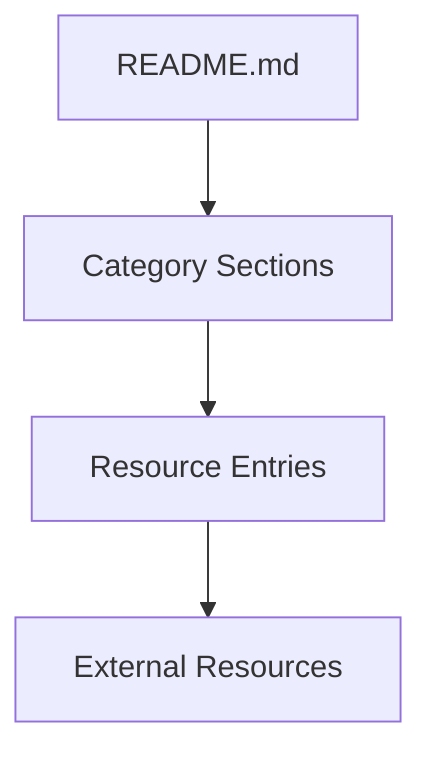

# System Patterns: Awesome Amazon Q Developer

## System Architecture

The "Awesome Amazon Q Developer" project follows a simple but effective architecture common to "awesome lists" in the GitHub ecosystem:



### Core Components

1. **README.md**: The primary file containing all content, organized in a structured markdown format.

2. **Category Sections**: Logical groupings of resources based on themes, use cases, or topics.

3. **Resource Entries**: Individual links with descriptive text, formatted consistently.

4. **External Resources**: The actual content hosted elsewhere that users are directed to.

## Key Technical Decisions

### Single File Approach
- All content is maintained in a single README.md file
- Simplifies maintenance and contribution
- Follows established awesome-list conventions

### Markdown Format
- Uses GitHub-flavored Markdown for optimal rendering
- Leverages heading levels for clear hierarchical organization
- Employs consistent formatting for resource entries

### Content Organization
- Top-level categories with clear, descriptive names
- Resource entries with consistent formatting
- Type indicators (emoji) to distinguish content formats

## Design Patterns

### Resource Entry Pattern
Each resource follows a consistent pattern:
```
- [Type Emoji] [Resource Title](URL) - Brief description of the resource.
```

Example:
```
- 📝 [Using Q Developer and CDK to create multi-region deployments](https://example.com) - An example of using Amazon Q Developer to convert a CDK stack from single-region to multi-region deployment.
```

### Category Pattern
Categories are organized as second-level headings with emoji indicators:
```
## [Emoji] [Category Name]
```

Example:
```
## 🏗️ Infrastructure as Code
```

### Table of Contents Pattern
A table of contents at the beginning links to all categories:
```
## Contents
- [Category 1](#category-1)
- [Category 2](#category-2)
```

## Component Relationships

### Content Flow
1. Users discover the list through GitHub, search engines, or referrals
2. The table of contents provides an overview and quick navigation
3. Categories help users find relevant sections
4. Resource entries direct users to external content

### Contribution Flow
1. Contributors identify valuable resources
2. They fork the repository and add entries following the established patterns
3. Pull requests are submitted for review
4. Maintainers review and merge quality contributions

## Maintenance Patterns

### Quality Control
- Regular review of existing resources for continued relevance
- Verification of links to ensure they remain active
- Assessment of new contributions against quality standards

### Growth Strategy
- Continuous addition of new, high-quality resources
- Expansion into emerging Amazon Q Developer use cases
- Refinement of categories as the ecosystem evolves
